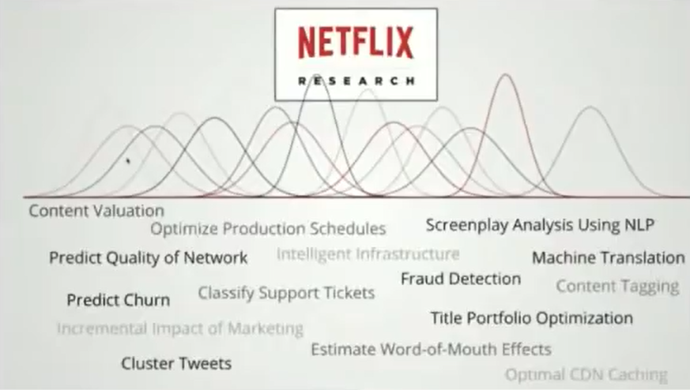

# Stanford MLSys Seminar: Principles of Good Machine Learning Systems Design - Chip Huyen
Just watched an awesome talk by Chip Huyen on Principles of Good Machine Learning Systems Design from the Stanford MLSys Seminar series, and let me tell you, it's a goldmine for anyone looking to bridge the gap between ML research and production

It was a truly insightful talk, packed with practical advice and a clear roadmap for navigating the complexities of ML in the real world. Highly recommend checking it out: [Stanford MLSys Seminar Episode 5](https://www.youtube.com/watch?v=c_AUuTuPA5k&t=1581s&ab_channel=StanfordMLSysSeminars)

Let's dive into some of the key takeaways

### Table of Contents
0. [Abstract](#abstract)
1. [ML in Research vs. Production: A Tale of Two Worlds](#part-1)
2. [ML Production Myths Debunked](#part-2)
3. [The Iterative ML Process](#part-3)
4. 

## Abstract 
This talk covers what it means to operationalize ML models. It starts by analyzing the difference between ML in research vs. in production, ML systems vs. traditional software, as well as myths about ML production.

It then goes over the principles of good ML systems design and introduces an iterative framework for ML systems design, from scoping the project, data management, model development, deployment, maintenance, to business analysis. It covers the differences between DataOps, ML Engineering, MLOps, and data science, and where each fits into the framework. It also discusses the main skills each stage requires, which can help companies in structuring their teams.

The talk ends with a survey of the ML production ecosystem, the economics of open source, and open-core businesses.

## 1. ML in Research vs. Production: A Tale of Two Worlds 

Chip kicked things off by highlighting the fundamental differences between ML in a research setting and in production. It's not just about bigger models.

*
ML in Research vs. Production
*

| |Research |Production |
|-|---------|-----------|
|Objectives|Model performance |Different stakeholders have different objectives |
|Computational priority|Fast training, high throughput |Fast inference, low latency |
|Data |Static |Constantly Shifting |
|Fairness |Good to have (sadly) |Important |
|Interpretability |Good to have |Important |

*   **Objectives:** In research, it's usually about **clear, singular objectives**, often focused on achieving the highest model performance on a specific dataset or leaderboard. Think pushing the accuracy needle! But in production? It's a complex balancing act with **multiple stakeholders**. The ML team might want accuracy, the product team demands fast inference (because **"latency costs a lot of money!"**), sales wants to boost ads, and managers are all about maximizing profit. You've got to build systems that satisfy *all* these diverse goals.
*   **Computational Priority:** In research, you're often training models many, many times, so the focus is on **high throughput** to make the most of your hardware during training. In contrast, in production, you might train a model once, but you'll serve it *countless* times. This means the priority shifts dramatically to **fast inference (low latency)**. Chip used a super neat analogy of an ant carrying leaves: 
    + latency is how long it takes to carry one leaf
    + throughput is how many leaves it carries over time
    
    It gets complex when you're serving multiple customers, as higher latency can surprisingly lead to higher throughput if you're batching requests – but in production, **real-time inference** is often preferred because even a small increase in latency can significantly reduce conversion rates and revenue.

*   **Data & Other Factors:** Research often uses **static, standardized datasets**, while production data is **dynamic and can change rapidly** due to things like new marketing campaigns or shifting user demographics. Also, while **fairness and interpretability** are increasingly pursued in research, they're often still niche. In production, however, especially in critical applications like medicine, these become **extremely important characteristics** of the model itself, not just an afterthought.

## 2. ML Production Myths Debunked 

Chip also tackled some common misconceptions about ML in production:

*   **Myth 1: Deploying is Hard.** Chip says **deploying a model is actually pretty easy** with modern frameworks – you can create an endpoint and build a simple app in hours. The *real* challenge is **deploying it reliably**: keeping it up, minimizing latency, getting alerted to issues, debugging, and rolling back updates. It's about building the entire infrastructure around it for monitoring and maintenance.
*   **Myth 2: You Only Deploy One or Two ML Models.** Nope! Services and apps often require **many different ML models**. Think about Uber serving in 100 countries, potentially needing different models for different demographics, leading to hundreds or even thousands of models in production. Netflix, Booking.com (150+ models!), and Uber (thousands!) are prime examples.
*
ML models deployed in Netflix
*

*   **Myth 3: If We Don't Do Anything, Model Performance Remains the Same**. Software generally suffers from "bit rot" – it decays over time. ML models are even more susceptible due to **concept drift**, where the underlying data distribution or task requirements change. A sentiment analysis model might need to adapt if the company suddenly wants to classify anger instead of just positive/negative. Chip recommends regularly evaluating model performance on current data compared to data from months ago to understand this degradation.
*   **Myth 4: You Don't Need to Update Models Much.** This ties into concept drift. Project managers often budget for initial development but overlook continuous updates. Chip suggests a **20/80 rule**: 20% investment in initial development, 80% in **iterative development and improvement** afterward. The key question isn't *how often you should* update, but **how often you *can*** update. Companies like Netflix deploy thousands of times a day, and AWS every 11 seconds! Chip believes that if ML engineers understood Devops better, the world (or at least ML systems) would be a much better place!
*   **Myth 5: Scale Isn't an Issue for Most Companies.** While many companies start small, over 50% of engineers work for companies with 100+ employees, meaning most engineers *will* have to think about scale. So, it's wise to consider it!
*
Distribution of Company Size
*

*   **Myth 6: ML Can Magically Transform Business Overnight.** AI isn't a snake oil! It takes time and maturity. Only a small percentage of companies investing in ML see immediate returns, often because they're in early stages. Companies like Google, who have seen incredible transformations (like 100% of English queries processed by BERT in 2020), have been investing in AI for many years. The more mature a company's ML pipeline, the faster it can bring models into production, reducing engineering costs and improving support. Managing expectations is crucial!
*
Efficiency improves with maturity
*

## 3. The Iterative ML Process 

Chip introduced an **iterative process for ML production**, covering stages from project scoping to business analysis. She also touched on the often-confusing roles of data science and ML engineering, noting that roles can be very fluid across companies (e.g., Uber's ML team focusing on infrastructure, data science on business insights).
*
The Iterative ML Process
*

*This diagram breaks down the different stages of the ML production pipeline, moving beyond just the model itself to encompass the entire lifecycle.*

### 3.1. The "10 out of 10 Graph": A Blueprint for ML Production

Chip's diagram is structured in layers to illustrate the complexity:

*   **Inner Layer:** Represents the **different stages** in the pipeline.
*   **Middle Layer:** Focuses on the **confusing, yet common, terminology** like DataOps, MLOps, ML Engineering, and Data Science, highlighting where each broadly fits in.
*   **Outermost Layer:** Indicates the **main skills required** at each stage.

While the diagram shows a single arrow between stages, Chip emphasizes that in reality, it's "a lot more complicated than that" with "a lot more arrows" and interconnectedness.

### 3.2. Understanding the Fluid Roles: Data Science vs. ML Engineering

One key area of confusion Chip addresses is the distinction between Data Science and Machine Learning Engineering, noting that **roles can be very fluid across companies**.

*   **Data Science:** Often focuses on using statistics to **generate business insights** from data. Chip hypothesizes that many data scientists transitioned into modeling roles due to existing in-house teams and company requirements before dedicated ML teams were common.
*   **Machine Learning Engineering:** Primarily aims to **build machine learning products**.

Chip highlights Uber as an example where data scientists generate business insights, while the ML team builds ML products, even though both share common infrastructure for data management. In contrast, Netflix has a core infra team for both data science and ML, and separate algorithm teams. This really shows that there's **no single standardization** across the industry for team structures.

### 3.3. The Iterative Process Stages: A Deep Dive

Here's a more detailed breakdown of each stage and what happens within them:

1.  **Project Scoping:**
    *   This is where it all begins! You **plan the budget, manage expectations**, and define the problem you're trying to solve. Chip stresses that an ML system **has to solve a problem**; otherwise, it just creates more maintenance and costs. Don't jump into complex algorithms if a simple heuristic can get you "50% of the way there".

2.  **Data Management:**
    *   This stage is all about the data itself. It involves **collecting data, tracking data lineage** (where it comes from), deciding **how to store data** (e.g., data lake vs. data warehouse), and **ingesting** it. This can involve query engines like ElasticSearch or a combination of tools.

3.  **ML Development:**
    *   Once you have the data, you **create datasets** for training, which includes **labeling, partitioning, sampling, and slicing**.
    *   Then comes **model selection, training, and evaluation**. If you're "unlucky," you'll deal with distributed training (which can be "still painful," especially with Python, though companies like Uber and OpenAI are doing great work in this area).
    *   Models are then **optimized and compressed** for deployment.

4.  **Deployment & Serving:**
    *   **Deploying** means putting your application on some hardware, while **serving** means responding to user requests. In serverless environments, these terms are often used interchangeably.
    *   This stage also involves **initial detection and handling of data drift** (when input data changes over time).
    *   You'll define **releasing strategies** and **validate your deployments**.

5.  **Monitoring & Maintenance:**
    *   Chip feels this stage is "still very much underdeveloped for machine learning".
    *   However, she believes that **many ML engineering problems can be solved using existing tools from the DevOps world**.
    *   **Monitoring is absolutely crucial**. Since you won't have real-time labels for accuracy, you need to monitor **proxies** like conversion rates or click-through rates, but be careful as these can be misleading.
    *   Define **metrics for both input data** (e.g., expected ranges, fill rates) and **model output** (e.g., shifts in predicted class distributions). Tools like Grafana or New Relic can help.
    *   **Implement tracing with IDs** to track requests through different system components, making debugging much easier.
    *   Ensure **feature engineering pipelines for training and production are identical** to avoid subtle but significant bugs. Logging input systems can also be invaluable for future training data.

6.  **Business Analysis:**
    *   This final stage focuses on **integrating and managing the business impact** of the ML system.
    *   It deals with **business analysis, user experience, and governance** (e.g., who has access to what data).

### 3.4. Key Insights on ML Engineering

Chip also shares some general principles:

*   The tweet that ML engineering is "mostly just machine learning and mostly engineering and not much machine learning" points to the heavy engineering aspect of putting ML into production.
*   ML engineers **should have knowledge about the underlying system and hardware**. Chip references the "hardware lottery," where research ideas gain popularity not because they're inherently better, but because they're better suited to existing hardware. Companies like Apple and Nvidia are working to bridge this gap by developing both chips and applications.

This iterative process highlights that ML in production is a continuous cycle of development, deployment, monitoring, and refinement, requiring a broad set of skills beyond just model building.

## 4. Phases of Adoption 
She then outlined **four phases of ML adoption** that companies typically go through:

1.  **Before Machine Learning:** Don't jump straight to complex algorithms! Often, a simple heuristic can solve 50% of the problem, giving you a 100% boost. Facebook's news feed, for instance, started chronologically and worked for years before needing complex algorithms.
2.  **Go with Simple ML Models:** Once you decide to use ML, **start simple**. This helps validate your hypothesis, provides visibility into data relationships, and most importantly, **establishes a trustworthy pipeline**. Many outages are caused by engineering issues in distributed pipelines, not ML errors. You need a reliable pipeline before optimizing!
3.  **Optimize Simple Models:** After you have a solid pipeline and validated the approach, optimize your simple models. This can involve feature engineering, collecting more data, or using powerful conventional models like XGBoost or decision trees, which are often surprisingly hard to beat.
4.  **Go with Complex ML Models:** Only after exhausting the potential of simpler models and having a robust pipeline should you consider more complex ML models.

And the overarching principle of good ML system design? It has to **solve a problem**. If it doesn't, it just creates more maintenance and costs.

### Q&A Highlights: Deeper Dives 

The Q&A session brought up some great points:

*   **Deployment in Medicine:** While deploying can be easy, specific applications like medicine present unique challenges. These include:
    *   **Practical Challenges:** Getting and annotating patient data is hard due to **cost, slowness, privacy concerns**, and the need for domain expertise. Medical data also comes in tricky formats (large images like CT scans, graph data for drug discovery, irregular time-series data).
    *   **Ethical Challenges:** Interpretability and fairness are **extremely important** in medicine, as people need to trust AI systems, especially when lives are at stake.
*   **Dealing with Concept Drift/Distributional Shift:** This is a major bottleneck!
    *   **Monitor, Monitor, Monitor:** You **must monitor** your models. But you can't just check accuracy because you won't have real-time labels. Instead, use **proxies** like conversion rates or click-through rates, but be aware these can be misleading (e.g., Google's search engine change initially lowered click rates but increased revenue due to better relevance).
    *   **Define Metrics:** Define metrics for both **input data** (e.g., expected ranges for features, changes in fill rates) and **model output** (e.g., shifts in predicted class distributions). Existing tools from Devops can help monitor these metrics.
    *   **Tracing:** Implement tracing with IDs to track requests through different system components for easier debugging when things go wrong.
    *   **Consistent Feature Engineering:** Ensure that feature engineering pipelines for training and production are **identical** to avoid subtle but significant bugs. Logging input systems can also be useful for future training data.
*   **Getting Researchers to Care About Production Metrics:** This is an active area of research!
    *   **Adaptive Leaderboards:** Instead of a single leaderboard for performance, create **adaptive leaderboards** where users can specify the importance of different variables like performance, interpretability, and inference costs.
    *   **Multi-Dimensional Benchmarks:** Initiatives like **MLPerf** are crucial for comparing hardware efficiency, training/inference times, and even dollar costs on cloud providers.
*   **ML Engineers & System Knowledge:** The idea that ML engineers don't need to know about the underlying system is a point of contention. Chip agrees they should, citing the **"hardware lottery"** – where research ideas gain popularity not because they're inherently better, but because they're better suited to existing hardware. Companies like Apple and Nvidia are working to bridge this gap by developing both chips and applications.

Chip wrapped up by mentioning that the course videos might be available online and publicly, as she's a huge believer in open source!
